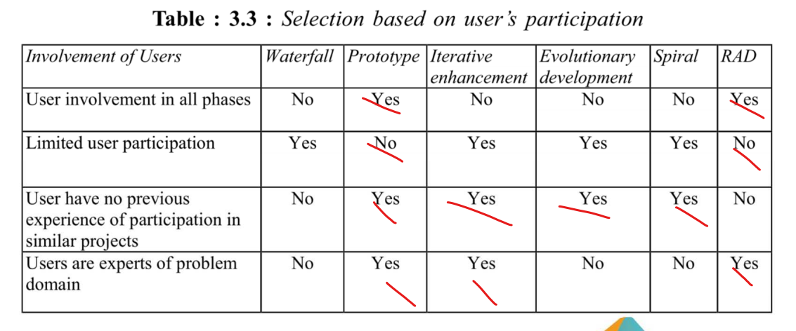
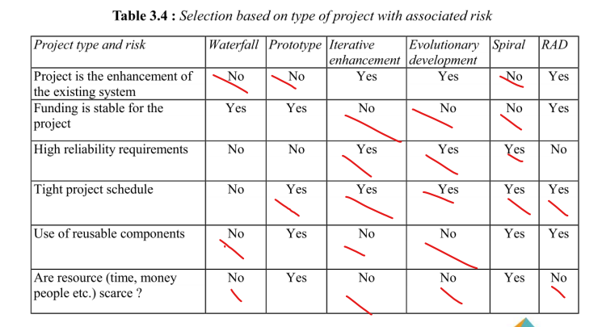

# Processo de Desenvolvimento de Software

##  Histórico de Versão

| **Data** | **Versão** | **Descrição** | **Autor** |
| :--------: | :--------: | :--------:  | :--------: | 
| 17/04/2024 | 1.0 | Criação do Documento  | Raphael, Gustavo Melo |

Critérios propostos por GUPTA para escolher o processo de desenvolvimento, com base nas características dos Requisitos, da equipe de desenvolvimento, do envolvimento do usuário e do tipo de projeto e risco associado, respectivamente:

O resultado foi:

- Cascata: 7
- Protótipo: 9
- **Iterativo-incremental**: 13
- Evolutivo: 12
- Espiral: 6
- RAD: 11 

Com base no framework GUPTA, o processo escolhido para o desenvolvimento será o Scrum/XP, que tem um ciclo de vida iterativo incremental. As fases do fluxo de trabalho de desenvolvimento são extraídas do Scrum, sendo:

- **Sprint Planning**: nessa fase será planejado as atividades que serão executadas. Para que ocorra de maneira correta, a equipe se reúne para realizar esse planejamento em conjunto.  
- **Sprint Review**: é nesse momento em que a equipe faz uma revisão de como foram feitas as coisas durante a Sprint. 
- **Sprint Retrospective**: uma vez concluída a revisão, a equipe debate sobre os pontos positivos da sprint passada e as possíveis melhorias para a próxima sprint.

Já enquanto equipe de desenvolvimento estaremos aplicando práticas do Extreme Programming (XP). Seriam essas práticas:

- **Pair-programming**: dois membros da equipe trabalhando na mesma estação, onde um programa e o outro revisa.
- **Programação Orientada a Histórias**: a equipe de desenvolvimento, irá trabalhar com funcionalidades em pequenos incrementos, com base em histórias de usuário.
- **On-site customer**: cliente sempre por perto para dar feedbacks.
- **Propriedade coletiva do código**: todos os membros da equipe terão acesso aberto ao código.

## Engenharia de Requisitos 

Sobre as facetas da ER **escolhemos o processo participativo**, este é um processo que é ideal quando o Cliente e o Fornecedor estão sempre colaborando um com o outro, tendo um forte envolvimento e tendo um envolvimento constante. Há, também, um backlog do produto com histórias de usuários e protótipos. 

## Etapas do processo de ER

- **Elicitação e Descoberta**: Atividade que busca levantar os requisitos iniciais, ajudar a entender o problema e se alinhar com os stakeholders.

    - <u>Como iremos aplicar</u>: Entrevistas com o cliente por meio de plataformas como Google Meet, Discord, Teams ou similares. Anotando todas as declarações em um documento.

- **Análise e Consenso**: Pegar requisitos “brutos” e fazer uma análise e assim decidir se fazem sentido e estão alinhados com os objetivos do projeto. 

    - <u>Como iremos aplicar</u>:  Iremos revisar os requisitos coletados, identificar conflitos ou inconsistências e trabalhar para resolvê-los. Promoveremos discussões e reuniões com os stakeholders para garantir que todos concordem com os requisitos definidos por meio das ferramentas de vídeo chamadas listadas na etapa anterior.

- **Declaração**: Refere-se a declarar seja por linguagem natural/oral/estruturada ou não os requisitos que estão sendo levantados, é feita junto com a Elicitação e Descoberta.

    - <u>Como iremos aplicar</u>: Os requisitos serão separados em funcionais e não-funcionais no backlog do produto, e os funcionais irão passar por um refinamento até chegarem no nível de história do usuário e estarem prontos para entrar em uma Sprint.

- **Representação**: Define como os requisitos serão apresentados no projeto, seja de maneira formal, semiformal ou informal.

    - <u>Como iremos aplicar</u>: Vamos documentar os requisitos no backlog por meio de níveis de refinamento (Temas, Épicos e Histórias de Usuário), de maneira padronizada por tabela.

- **Verificação e Validação**: Revisão e testes são realizados para garantir que os requisitos estejam corretos e alinhados com as necessidades do usuário final.

    - <u>Como iremos aplicar</u>: Para uma história ser definida como concluída ao fim de uma sprint ela deverá passar pelos critérios de aceitação definidos pelo cliente, para que atendam as necessidades esperadas.

- **Organização e Atualização**: Os requisitos são organizados de forma sistemática e atualizados conforme necessário ao longo do ciclo de desenvolvimento.

    - <u>Como iremos aplicar</u>: Como já dito anteriormente, os requisitos estarão organizados em um Backlog, que sempre será atualizado em caso de alteração dos requisitos.

|Nome das Atividades|Método|Ferramenta|Entrega|
|-|-|-|-|
|Elicitação e Descoberta|Entrevista|Google meet, Discord|Lista provisória com os requisitos funcionais e não funcionais|
|Análise e Consenso|Conversa em grupo|Google meet, Discord|Lista definitiva com os requisitos funcionais e não funcionais|
|Declaração|Product Planning|Histórias de Usuário|Product Backlog|
|Representação|Documentação no backlog|Mkdocs |Backlog do produto|
|Verificação & Validação|Testes de Software|Testes Unitários|Integração Contínua no Github Actions|
Organização e Atualização|Product Planning Sprint Planning|Votação democrática|Product Backlog Sprint Backlog|

